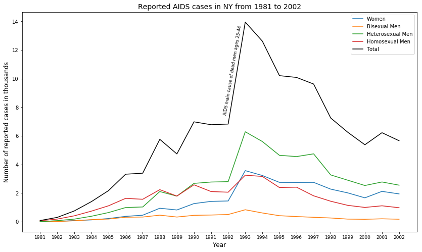

I downloaded a dataset form the Center for Disease and Prevention portal. (https://wonder.cdc.gov/controller/datarequest/D14). The data set contains information on reported AIDS cases in the New York area from 1981 to 2002.
It shoes a peak in 1992 when it became the main cause for deaths in men ages 25-44. Several efforts were made by the Clinton administration and society to control the epidemic which resulted in a downfall after 1993.

